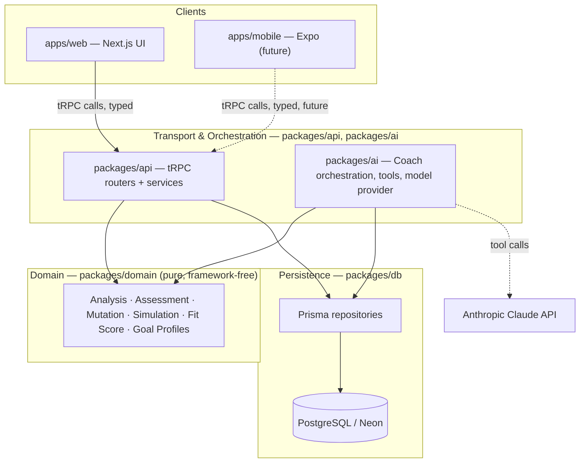
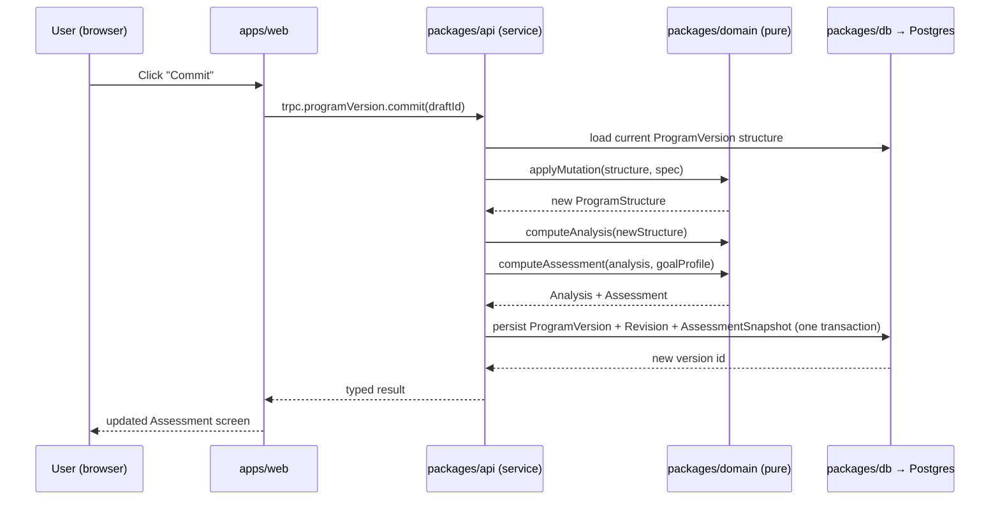
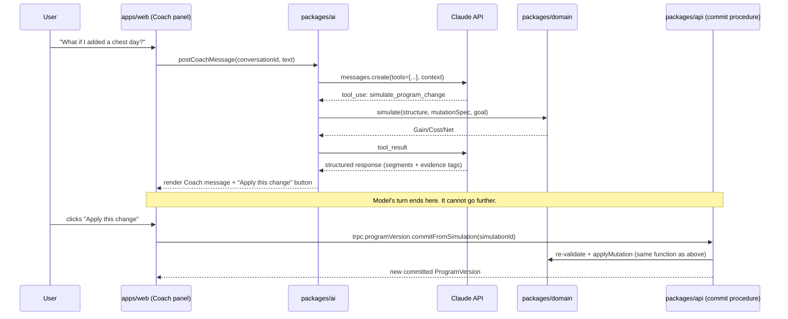

# 02 — System Architecture (PART B)

## The three-layer rule

Every piece of code in this system belongs to exactly one of three layers. This is the single most important structural idea in the whole architecture — nearly every other document refers back to it.

- **Domain (`packages/domain`)** — pure computation. Analysis, Assessment, the mutation function, simulation composition, Fit Score, evidence diffing, Goal Profile definitions. No database import, no HTTP, no framework. Every function here is a plain input → plain output transformation, fully testable with in-memory fixtures.
- **Persistence (`packages/db`)** — Prisma schema, migrations, and repository functions (`loadProgramVersionStructure`, `saveNewProgramVersion`, `loadExerciseReferenceData`, …). No business logic. Translates Prisma rows to and from the plain TypeScript interfaces `packages/domain` operates on.
- **Transport & orchestration (`packages/api`, `packages/ai`)** — the only layer allowed to *coordinate* domain and persistence. A tRPC procedure (or an AI tool handler) is a thin wrapper: load data via `packages/db`, run pure logic via `packages/domain`, persist the result via `packages/db`, return a typed response.

This gives one authoritative rule for the whole codebase: **if you're writing a business rule, it goes in `packages/domain`; if you're writing "what happens when a request comes in," it goes in `packages/api` or `packages/ai`.** An AI coding agent implementing any phase can use this rule to decide where new code belongs without re-deriving it.

## Runtime components

| Component | Responsibility | Deployed as |
|---|---|---|
| `apps/web` | UI for Build/Analyze/Commit/Train/Review, plus hosts the API at MVP | Vercel (Next.js) |
| `packages/api` (mounted inside `apps/web`) | tRPC routers, request auth/authorization, orchestration services | Same Vercel deployment |
| `packages/ai` (mounted inside `apps/web`) | AI Coach orchestration: context assembly, tool execution, model calls | Same Vercel deployment, streaming responses |
| `packages/domain` | Pure business rules | Imported library, no independent runtime |
| `packages/db` | Prisma client + repositories | Imported library, connects to Neon |
| PostgreSQL (Neon) | System of record | Neon managed Postgres |
| Anthropic Claude API | Language model for the Coach | External, called only from `packages/ai` |
| Sentry | Error monitoring | External |
| `apps/mobile` (future) | Train/Observe-first mobile client | Expo, calls the same deployed API |

## Why the AI orchestration layer is architecturally separate from ordinary API orchestration

`packages/ai` and `packages/api` both sit in the "transport & orchestration" layer, but they are **not** the same package, and this split is deliberate rather than cosmetic: `packages/ai` is given access to read-domain functions, `simulate()`, and low-risk mutation helpers (`note_constraint`, `note_temporary_constraint`), but it has **no import path at all** to the function that commits a new `ProgramVersion`. That function is only ever invoked from a `packages/api` procedure that a human clicks a button to call. This is covered in full in `10-ai-coach-architecture.md`; it's introduced here because it is a system-level boundary, not just an implementation detail of one feature.

## Request flow, ordinary case (e.g., "commit a program edit")

## Request flow, AI Coach case (illustrates the confirmation boundary)

The model's tool loop terminates at "propose"; the mutating call on the right only exists as a procedure a human triggers directly. See `10-ai-coach-architecture.md` for why this is enforced by *what code can import what*, not only by system-prompt instruction.

## Environments

| Environment | Purpose | Database |
|---|---|---|
| Local dev | Developer machines | Local Postgres or a personal Neon branch |
| Preview | One per pull request | Neon branch, created/destroyed with the PR |
| Staging | Pre-production sanity check, optional pre-launch | Long-lived Neon branch |
| Production | Real users | Neon primary |

Details of provisioning, secrets, and CI/CD live in `15-deployment.md`.
