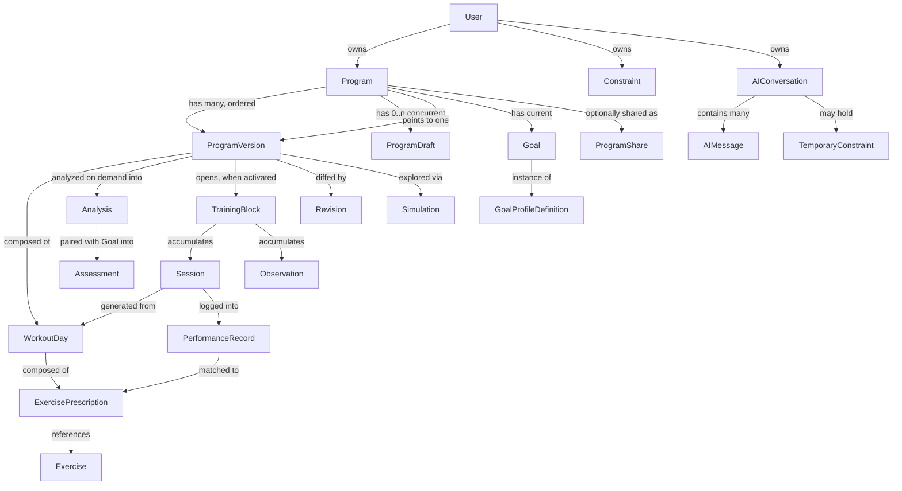

# 03 — Domain Model (PART C)

This defines the conceptual domain before any database or UI concerns. Every entity below maps to the Final Freeze's §6 glossary; where this document adds structure the glossary left implicit (e.g., splitting `Goal` from `GoalProfileDefinition`), that is called out explicitly and logged in `DECISIONS.md`.

## Entity relationship overview



## Terminology note (read this before the tables below)
"Session" is overloaded in the source documents. This domain model always distinguishes:
- **workout Session** — an executed instance of a WorkoutDay (has `PerformanceRecord`s).
- **Coach conversation** — an `AIConversation`, i.e. a chat thread. `TemporaryConstraint` is scoped to a Coach conversation, never to a workout Session.

## Entities

### User
- **Purpose:** account holder.
- **Owns:** Programs, persistent Constraints, AIConversations, Observations.
- **Lifecycle:** created at signup; not deleted, only anonymized/exported on request (see `14-security-and-data-ownership.md`).
- **Mutable:** profile fields yes; identity no.

### GoalProfileDefinition
- **Purpose:** the configuration bundle for one training objective type (e.g., Hypertrophy) — which axes matter, their weights, status-band thresholds, action templates.
- **Ownership:** not user-owned; canonical reference/config data, versioned.
- **Lifecycle:** created by an engineer/product decision (with sports-science sign-off before `validated: true`), not by end users.
- **Mutable:** the *config* can be revised (new `configVersion`), but a given version is immutable once used to produce a persisted `AssessmentSnapshot` (see "Historical reproducibility," `07-versioning-and-simulation.md`).
- **MVP:** exactly one row (`HYPERTROPHY`). Architecture treats this as N-many from day one — see `05-analysis-engine.md`.

### Goal
- **Purpose:** a Program's stated training objective — an *instance* referencing a GoalProfileDefinition.
- **Why it's a separate entity from GoalProfileDefinition** (a deliberate structural choice, not in the source glossary verbatim): the Final Freeze's §6 glossary describes Goal as "a stated training objective," singular per-program-in-use, while §10 requires Assessment to be computable for *any* Goal on demand, not just the Program's current one. Modeling `Goal` as its own row — even though at MVP it is functionally just a pointer to a profile — leaves room for future per-instance parameters (e.g., a target total for a future Strength goal) without a schema change, and lets Assessment reference a *specific* Goal, including a historical one a Program no longer uses.
- **Lifecycle:** created when a user picks/changes a Program's goal. Old Goal rows are never deleted when a Program's current goal changes — they remain addressable for historical Assessment queries.
- **Mutable:** no, immutable once created (a "goal change" creates a new Goal row and repoints `Program.currentGoalId`).

### Program
- **Purpose:** a named container — one training endeavor.
- **Owns:** an ordered list of ProgramVersions, 0..n concurrent ProgramDrafts, a pointer to the active version, a current Goal.
- **Lifecycle:** created by the user; never hard-deleted in normal use — `archivedAt` marks it inactive.
- **Mutable:** name, currentGoalId, activeVersionId, visibility are all mutable on the container. Nothing about a specific ProgramVersion's *content* is ever touched.
- **Permissions:** owner has full read/write. `visibility` (private/shared/public) and `ProgramShare` rows govern others' access — see `14-security-and-data-ownership.md`.

### ProgramDraft
- **Purpose:** an *uncommitted* candidate structure being edited in the Builder.
- **Why many-per-Program, not one:** the Master Blueprint's job-to-be-done #4 is explicitly "compare two candidate structures side by side before committing." A one-draft-per-program model would silently foreclose this. A Program can therefore hold several concurrent, independently-labeled Drafts (e.g., "Option A — more chest volume" vs. "Option B — 5-day split"), each independently analyzable. This is also how Round 2's "Plans — a persistent Drafts concept" (§4) is satisfied rather than treated as a disposable builder session.
- **Lifecycle:** created when a user starts editing (from scratch or from an existing ProgramVersion as a base); consumed on Commit (`status → COMMITTED`, `committedAsVersionId` set) or explicitly discarded.
- **Mutable:** yes — this is the *only* structural entity in the whole domain model that is allowed to mutate in place. Everything downstream of Commit is immutable.
- **Relationship to Simulation:** a Draft is a coarse-grained, user-driven candidate; a Simulation (below) is a fine-grained, often AI-proposed, single hypothetical tweak tested against either the active ProgramVersion or a Draft's current structure. They serve different jobs and are not the same mechanism — see `07-versioning-and-simulation.md`.

### ProgramVersion
- **Purpose:** an immutable structural snapshot, created only on explicit commit.
- **Immutability:** absolute. No field on a persisted ProgramVersion is ever updated after creation. A further edit always produces version N+1.
- **Historical significance:** this is the unit the whole product's "why did my Assessment change" answerability depends on — the answer is always "because version N+1 differs from version N in exactly this way," never "because something recalculated in place."
- **Composed of:** WorkoutDays → ExercisePrescriptions (normalized, queryable) **and** a canonical `structureSnapshot` (immutable JSON, the authoritative record — see `04-database-schema.md` for why both exist).
- **Creation trigger:** explicit user Commit, or an AI-proposed change the user explicitly applies. Never autosave, never a keystroke.
- **Does not hold:** a Goal reference. Assessment is always computed by pairing a ProgramVersion with a Goal supplied at query time.

### WorkoutDay / ExercisePrescription
- **Purpose:** the structural content of a ProgramVersion — template days and their prescribed exercises, sets, reps, load scheme, position.
- **Lifecycle:** created alongside their parent ProgramVersion; never independently mutated or deleted (immutable by inheritance from the parent).
- **Not executed events:** these are templates. A workout Session is a separate entity generated *from* a WorkoutDay.

### Exercise / MuscleGroup
- **Purpose:** canonical shared reference data — not user-owned.
- **Lifecycle:** seeded/curated centrally (see Phase 1 in `phases/phase-01-domain-and-database.md`). No user-facing CRUD at MVP.
- **Used by:** ExercisePrescription (which exercise), and by the Analysis engine's per-muscle-group volume/frequency calculations via `ExerciseMuscleInvolvement`.

### Revision
- **Purpose:** the diff-with-a-trigger between ProgramVersion N and N+1.
- **Fields of note:** `trigger` (manual commit vs. AI-applied simulation), optional `sourceSimulationId`, optional user-entered rationale note.
- **Not a structural diff store:** "What Changed" (per the Final Freeze §15) compares *Assessments*, not raw structure. Revision records the *fact and cause* of a version change; a structural diff for history-view display purposes is computed on demand by comparing two versions' normalized rows, not stored redundantly.

### Simulation
- **Purpose:** a persisted record of one hypothetical mutation tested against a specific base ProgramVersion — never persisted as a new ProgramVersion itself.
- **Lifecycle:** created every time `simulate()` runs; referenced later by an Apply action; becomes unusable ("stale") the moment its `baseVersionId` is no longer the Program's current latest version.
- **Full detail:** `07-versioning-and-simulation.md`.

### TrainingBlock
- **Purpose:** the real-world period a specific ProgramVersion was actively trained.
- **Lifecycle:** opens automatically when a ProgramVersion becomes a Program's active version; closes automatically (status `COMPLETED` if ≥1 workout Session was completed, else `ABANDONED`) the moment a *different* version becomes active, or the Program is archived. No separate explicit "end block" user action is required — Review is available for the current block at any time, complete or not (see `08-training-execution-and-evidence.md`).
- **Accumulates:** Sessions, Observations.

### Session (workout)
- **Purpose:** an executed instance of a WorkoutDay, logged against.
- **Creation:** generated lazily/on-demand ("give me today's/next session") from the active ProgramVersion's WorkoutDay template — not bulk-pregenerated for an entire block, since block length is not a hard constraint in this model.
- **Fields:** status (planned/in-progress/completed/skipped), timestamps.

### PerformanceRecord (Set)
- **Purpose:** actual logged data for one set, matched to its ExercisePrescription.
- **Honesty requirement:** deviations from plan are recorded uncorrected — this is what makes Review meaningful.

### Observation
- **Purpose:** user-entered subjective data not captured by PerformanceRecord (RPE notes, soreness, life-context notes).
- **Scope:** may attach to a Session, a TrainingBlock, or stand alone for a user.

### Constraint (persistent) / TemporaryConstraint (Coach-conversation-scoped)
- **Constraint:** durable, user-level, affects all future analysis/proposals. Minimally structured (`kind`: exercise avoidance / movement-pattern avoidance / freeform) so common cases are machine-checkable by the Builder and the AI, while freeform text remains available for anything that doesn't structure cleanly.
- **TemporaryConstraint:** scoped to one `AIConversation` (a Coach chat thread), *not* to a workout Session. Shapes that conversation's proposals only; never silently promoted to a persistent Constraint.

### AIConversation / AIMessage
- **Purpose:** the Coach's chat thread(s), scoped to a user and typically to a Program/Version in view.
- **AIMessage content:** structured **segments**, not raw prose — each segment carries an explicit `evidenceTag` (`PLANNED | EXECUTED | OBSERVED | INTERPRETED`). Full detail in `10-ai-coach-architecture.md`.

### Analysis / Assessment / Fit Score
- **Not independently persisted entities by default** — pure functions of (ProgramVersion structure, reference data) and (Analysis, GoalProfile) respectively. **Exception:** an `AssessmentSnapshot` is persisted at two specific moments (Commit, and TrainingBlock-end/Review) so historical Review screens show what the user actually saw, not a value retroactively changed by later threshold updates. Full rationale in `06-assessment-engine.md`.

### ProgramShare
- **Purpose:** grants a specific recipient user access to a Program (structure + Analysis + Assessment by default; execution history is a separate, explicit opt-in per share).
- **MVP status:** the `Program.visibility` enum column exists from day one; the `ProgramShare` table and all sharing logic are **not built** until the optional Phase 10 — see `17-roadmap-overview.md`.

## Evidence categorization: implicit vs. explicit
A subtlety worth stating precisely, since Round 2 emphasizes evidence tagging as "a literal field... not just a UI convention": for **non-AI screens**, the Planned/Executed/Observed/Interpreted category is *implicit by data source* — an Analysis/Assessment card is Planned by construction, a logged-sets summary is Executed by construction, an Observation display is Observed by construction. No redundant tag column is needed there; the source table already disambiguates it. The literal, explicit, per-claim tag is required specifically for **AI Coach output**, because that is the one surface where a single response can blend all four categories in one paragraph. See `10-ai-coach-architecture.md`.

## Core domain types (illustrative, not exhaustive — full shapes in the engine-specific docs)

```typescript
type EvidenceTag = 'PLANNED' | 'EXECUTED' | 'OBSERVED' | 'INTERPRETED';

interface ProgramStructure {
  workoutDays: WorkoutDayStructure[];
}

interface WorkoutDayStructure {
  id: string;          // stable within a version; regenerated per version
  orderIndex: number;
  name: string;
  prescriptions: ExercisePrescriptionStructure[];
}

interface ExercisePrescriptionStructure {
  id: string;
  orderIndex: number;
  exerciseId: string;
  targetSets: number;
  targetRepsLow: number;
  targetRepsHigh: number;
  targetRpe?: number;
  loadScheme: LoadScheme;
}

type LoadScheme =
  | { type: 'PERCENT_1RM'; percent: number }
  | { type: 'RPE_BASED'; rpe: number }
  | { type: 'FIXED_WEIGHT'; weight: number; unit: 'kg' | 'lb' }
  | { type: 'BODYWEIGHT' };
```

`MutationSpec`, `Analysis`, `Assessment`, `SimulationResult` are defined in `07-versioning-and-simulation.md`, `05-analysis-engine.md`, and `06-assessment-engine.md` respectively, and are not redefined here to avoid drift between documents.
