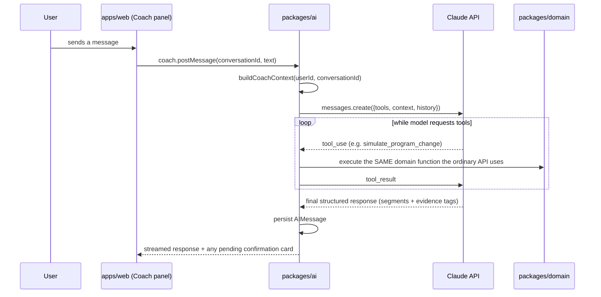

# 10 — AI Coach Architecture (PART G)

Implements L0 (Explainer) + L1 (Explorer) at MVP, with an explicit extension path to L2 (Historian) and a deliberately unbuilt stub for L3 (Correlator). Lives in `packages/ai/`.

## The one architectural fact that matters most here

**The model has no code path capable of applying a program change.** Not "is instructed not to" — *cannot*, because `packages/ai` never imports the function that persists a new `ProgramVersion`. That function (`commitFromMutation`, defined once in `packages/api/services/programVersionService.ts` — see `07-versioning-and-simulation.md`) is called from exactly two places, and `packages/ai` is not one of them. This turns Final Freeze §14's requirement ("Applying is a distinct, explicit user action — never inferred from conversational agreement") from a prompted behavior into a property of the dependency graph. Everything else in this document is built around preserving that property.

## Request flow



## Context construction

`buildCoachContext(userId, conversationId)` assembles a bounded, structured object — never a raw dump of tables:

```typescript
interface CoachContext {
  currentProgramVersion: { structure: ProgramStructure; analysis: Analysis; assessment: Assessment } | null;
  activeGoal: Goal;
  persistentConstraints: Constraint[];
  temporaryConstraints: TemporaryConstraint[];   // this conversation only
  recentHistorySummary: TrainingBlockSummary[] | null;  // populated only once L2 is enabled — see below
  conversationHistory: AIMessage[];              // recent turns, summarized beyond a window
}
```

For L2 (post-MVP), `recentHistorySummary` is a *summarized* retrieval over the user's own TrainingBlocks/Observations, not raw log dumps — this keeps context size bounded as history accumulates over years, and is the concrete mechanism behind Round 2 §12's "Year 2" pattern-surfacing capability.

## Tool system

| Tool (model-facing name) | Backing implementation | Can mutate? | Confirmation? |
|---|---|---|---|
| `lookup_exercises` | `packages/db` read query | No | No |
| `query_training_history` | `packages/db` read query over the caller's own data | No | No — **but not included in the tools array passed to the model until L2 is enabled** (see below) |
| `simulate_program_change` | Calls `packages/domain`'s `simulate()` — the exact function `09-api-architecture.md`'s `simulation` router also calls | No (persists only a `Simulation` record) | No — freely callable |
| `prepare_apply_confirmation` | Returns a UI-render payload (`{simulationId, summary}`) — **does not touch the database beyond reading the Simulation it references** | No | N/A — it doesn't apply anything; it hands the client something to render a button for |
| `note_constraint` | Writes a `Constraint` row | Yes (low-risk, reversible) | No, but must render visibly/editably afterward — never silent |
| `note_temporary_constraint` | Writes a `TemporaryConstraint` row scoped to this `AIConversation` | Yes (low-risk, conversation-scoped) | No |

**Naming choice, explained:** the Final Freeze's tool table (§17) names an `apply_program_change` tool with "confirmation required." This architecture implements that requirement by *not giving the model a tool that applies anything at all* — the model-facing tool is renamed `prepare_apply_confirmation` and is provably incapable of mutation (it has no import to the commit function), while the actual commit is a `programVersion.commitFromSimulation` call the **client** makes when a human clicks the rendered button. This is a strengthening of the spec's requirement, not a deviation from it — flagged explicitly and logged in `DECISIONS.md` (`ARCH-018`) because it's exactly the kind of interpretation choice that should be visible rather than silent.

**Tier gating:** `query_training_history` is implemented in Phase 8 (it's a cheap read query and `TrainingBlock` data already exists from Phase 6) but is simply **excluded from the tools array** passed to the model until an `L2_ENABLED` feature flag is on. This reconciles an apparent tension in the source spec — the tool is documented in the same table as the MVP tools, but §29's MVP scope lists L2 itself as post-MVP. The tool *existing* and the tool *being offered to the model* are different switches.

## Structured output and evidence tagging

The model does not return free-form prose that the server parses with regex. The final assistant turn uses a structured output schema:

```typescript
interface AIMessageSegment {
  type: 'text' | 'claim';
  tag?: EvidenceTag;          // required when type === 'claim'
  content: string;
  sourceRef?: string;         // e.g. an axis key or a Simulation id, for claim-type segments
}
```

This is what makes "every claim carries its own Planned/Executed/Observed/Interpreted tag" (Final Freeze §11) a literal, stored field rather than a UI convention layered on top of prose after the fact — see `03-domain-model.md`'s "implicit vs. explicit" note for why this literal tagging is needed here specifically and not on ordinary Analysis/Assessment screens.

## Grounding and hallucination prevention

- **System prompt** explicitly forbids stating any number not present in a tool result or the assembled context.
- **Authorization is injected, not model-supplied:** every tool handler receives `userId` from the already-authenticated server session; the model can never supply or influence which user's data a tool call touches, no matter what it "decides."
- **Post-processing validation (recommended hardening, not MVP-blocking):** a lightweight scan of the final response's `claim` segments for numeric tokens, cross-checked against numbers that actually appeared in tool results/context this turn; a mismatch is logged and can gate a regenerate. This is named as a V1 hardening step, not an MVP requirement — MVP relies on the structural guarantees above (no mutation path, context-bounded prompting) plus the system-prompt instruction.
- **Forbidden language list** (outcome guarantees, medical diagnosis) is enforced the same way — a simple pattern check on the final response before it's persisted/returned, in addition to system-prompt instruction, since prompting alone is not treated as sufficient for a hard product rule.

## Failure handling
Tool errors (e.g., `applyMutation` rejecting an invalid reference), model API errors, and timeouts all resolve to a graceful, conversational fallback message — never a raw error, and never a partial mutation. Because no tool call in this list can mutate program structure, there is no failure mode where a crash mid-tool-call leaves a program in a half-changed state.

## Model provider abstraction

```typescript
interface ModelProvider {
  complete(input: { messages: Message[]; tools: ToolDefinition[]; systemPrompt: string }): Promise<ModelResponse>;
}
```

`packages/ai`'s orchestration code depends only on this interface; `AnthropicProvider` is the concrete implementation. Tests use a `MockProvider` that returns scripted tool calls, which is how the grounding/authorization/confirmation-boundary tests in `13-testing-strategy.md` run without hitting a real model.

## Extension path to L2 and L3

- **L2 (Historian):** flip `L2_ENABLED`, which (a) adds `query_training_history` to the tools array and (b) populates `recentHistorySummary` in `buildCoachContext`. No change to the confirmation boundary, the mutation guarantees, or the structured-output schema — L2 is additive context and one additional read-only tool, not a new architecture.
- **L3 (Correlator):** deliberately **not stubbed with a fake implementation**. A `CrossUserAnalyticsProvider` interface name is reserved in comments only, unimplemented, so a future, independently-justified build has an obvious seam — but no code exists for it, and no tool implying cross-user access is registered anywhere in this phase plan. Building it is explicitly out of scope for every phase in `17-roadmap-overview.md`.

## Reserved seam: external decision-primitive providers (e.g. Jev)

A separate, unauthorized-pending-evidence extension point, reserved the same way `CrossUserAnalyticsProvider` is reserved above: a `DecisionProvider` interface name for an optional, advisory, feature-flagged pre-classifier sitting in front of the Claude tool-calling loop — evaluated in full in `19-jev-integration-review.md`. No implementation exists, no phase currently uses it, and the confirmation boundary described in this document (`packages/ai` has no import path to the commit function) applies to any such provider exactly as it applies to Claude itself — an external decision primitive gains no more authority than the conversational model it would sit beside. See `phases/phase-11-jev-prototype-candidate.md` for the gated, currently-unauthorized shape this would take if evidence ever justifies it.
